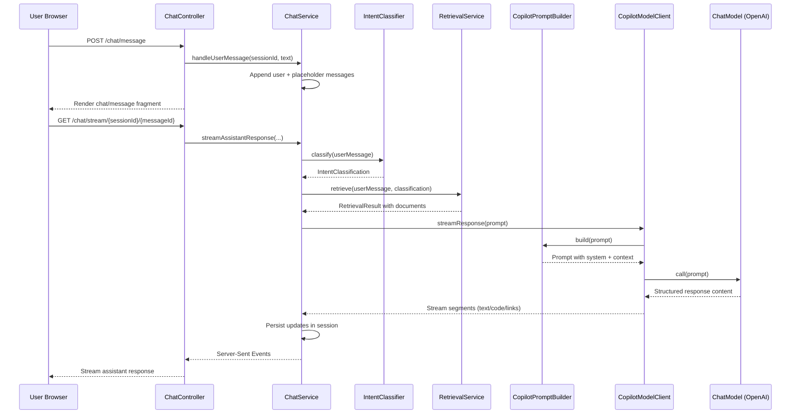

# GRETL RAG Starter

This bundle includes:
- `ingest_gretl.java` – single-file **JBang** ingester using **OpenAI embeddings** and a hardcoded whitelist (`https://gretl.app/reference.html` + anchors).
- `docker-compose.yml` – Postgres with **pgvector** and Adminer.
- `initdb/01_init.sql` – schema for pages/chunks/properties/examples.
- `initdb/02_readonly_user.sql` – creates a **read-only** user `gretl_ro` (password `change_me_ro`, change before prod).

## Quick start

```bash
# 1) Start Postgres + Adminer
docker compose up -d

# Adminer at http://localhost:8080
# System: PostgreSQL, Server: pgvector, User: gretl, Pass: gretl, DB: gretl_rag

# 2) Run the ingester (requires Java + JBang)
#    https://www.jbang.dev/download/
export OPENAI_API_KEY=sk-...

# Optional overrides (these match docker-compose)
export JDBC_URL=jdbc:postgresql://localhost:5432/gretl_rag
export JDBC_USER=gretl
export JDBC_PASS=gretl
export EMB_DIM=1536
export OPENAI_EMBED_MODEL=text-embedding-3-small

jbang ingest_gretl.java
```

## Copilot request flow



### Sequence details and examples

- **`POST /chat/message` → `handleUserMessage(sessionId, text)`**  
  The browser submits the raw chat text. Example: `"Kannst du mir die Pflicht-Properties für den CSV→Postgres Import zeigen?"`. The controller forwards it to `ChatService.handleUserMessage`, which creates the chat session if it does not exist yet and persists the user turn together with a placeholder assistant message.

- **`Append user + placeholder messages` → `Render chat/message fragment`**  
  The newly stored exchange is immediately rendered back to the UI so the user sees their message and a pending assistant bubble while the backend gathers context.

- **`GET /chat/stream/{sessionId}/{messageId}` → `streamAssistantResponse(...)`**  
  The frontend opens a Server-Sent Events stream for the pending assistant message. `ChatService.streamAssistantResponse` orchestrates the asynchronous steps that follow and writes tokens to the stream as soon as they are available.

- **`classify(userMessage)` → `IntentClassification`**
  `IntentClassifier` embeds the user question and compares it against the curated examples stored in `rag.task_examples`. The closest match determines the intent label (e.g. `label="task.csvimport"`, `confidence=0.88` with rationale `"Frage erwähnt CSV und PostGIS-Zieltabelle."`). These hints determine which Beispiele und Dokumente die Retrieval-Schicht laden soll und liefern dem Prompt zusätzliche Motivation.

- **`retrieve(userMessage, classification)` → `RetrievalResult`**  
  `RetrievalService` queries the vector store with the user text and the detected intent. Continuing the example, it could return the `CsvImport` task description and property snippets so the model has concrete documentation to cite.

- **`streamResponse(prompt)` → `build(prompt)` → `call(prompt)`**  
  `CopilotModelClient` assembles a streaming chat request. It delegates to `CopilotPromptBuilder` to compose the system message, classification summary, and retrieved context. The resulting prompt is sent to the configured `ChatModel` (OpenAI in production).

- **`Structured response content` → `Stream segments (text/code/links)`**  
  The OpenAI response is parsed into structured chunks—plain text, code blocks, and resource links. As tokens arrive, the client pushes each segment back to the `ChatService`, which updates the session transcript.

- **`Persist updates in session` → `Server-Sent Events` → `Stream assistant response`**
  The completed assistant turn is stored with all metadata. Each streamed chunk is forwarded over the open SSE connection so the user interface progressively displays the answer with tables, code fences, and links formatted according to the system prompt.

### Intent classifier tuning

- **Vektorbasierte Zuordnung:** `DatabaseIntentClassifier` nutzt die Embeddings aus `rag.task_examples`, um die Anfrage den vorhandenen GRETL-Tasks zuzuordnen. Damit die Qualität hoch bleibt, sollten für neue Tasks auch Beispiele mit Embeddings eingespielt werden.
- **Konfigurierbare Schwellenwerte:** Über `gretl.copilot.intent.*` lässt sich steuern, wie viele Kandidaten geprüft werden (`top-k`), ab welcher Ähnlichkeit ein Intent akzeptiert wird (`min-confidence`) und welches Fallback-Label bei unsicheren Treffern zurückgegeben wird.

## Exporting data as INSERT statements

You can dump the ingested data as plain `INSERT` commands for use in
pipelines or Codex-style demos. With the compose stack running:

```bash
# Open a shell inside the Postgres container (optional helper)
docker compose exec pgvector bash

# Inside the container: dump data-only SQL with INSERT statements
pg_dump -U gretl --schema=rag --data-only --inserts gretl_rag > /tmp/rag_inserts.sql

# Exit the container when done
exit

# Copy the dump file back to the host
docker compose cp pgvector:/tmp/rag_inserts.sql ./rag_inserts.sql
```

For non-interactive environments (CI/CD, pipelines), you can skip the shell
and stream the dump directly:

```bash
docker compose exec -T pgvector \
  pg_dump -U gretl --schema=rag --data-only --inserts gretl_rag > rag_inserts.sql
```

## Switching to a larger embedding model

If you choose `text-embedding-3-large` (~3072 dims):

1. Update SQL vector dims:
   ```sql
   ALTER TABLE rag.doc_chunks    ALTER COLUMN embedding TYPE vector(3072);
   ALTER TABLE rag.task_examples ALTER COLUMN embedding TYPE vector(3072);
   ```
2. Update env:
   ```bash
   export EMB_DIM=3072
   export OPENAI_EMBED_MODEL=text-embedding-3-large
   ```

Re-embed existing rows for best results.

## Notes
- The whitelist is in `ingest_gretl.java` (`ALLOWLIST`). By default only `reference.html` is crawled.
- For production, **change the read-only password** in `initdb/02_readonly_user.sql` before first start.
- Create IVFFLAT indexes after ingest (tune `lists` for your dataset size).
